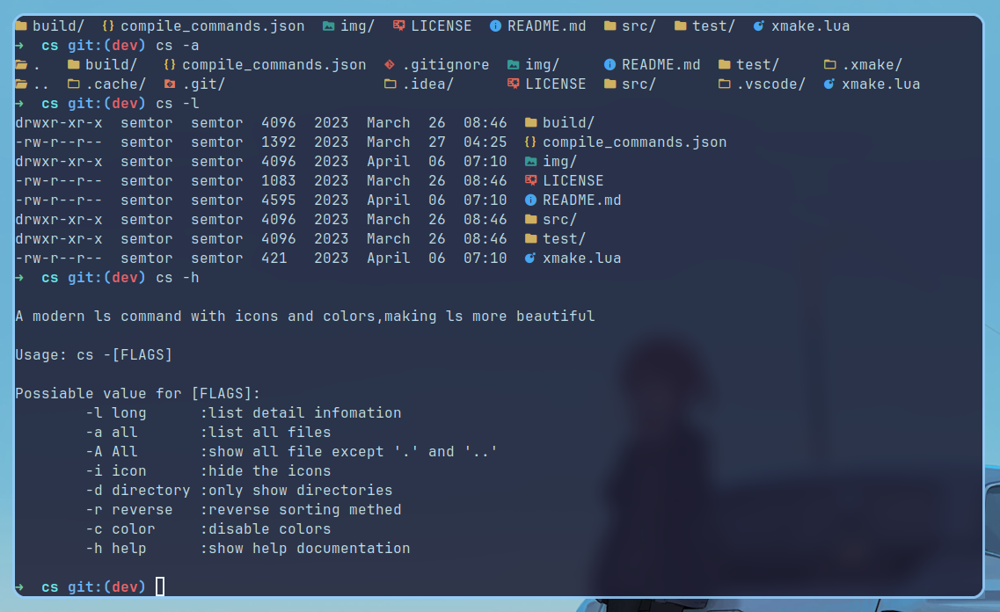
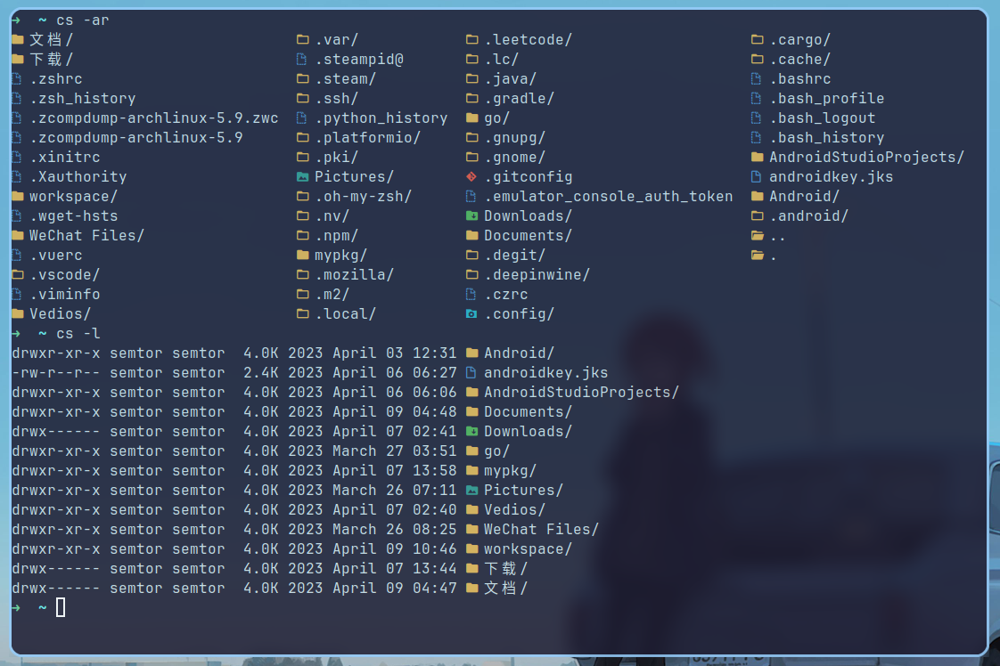
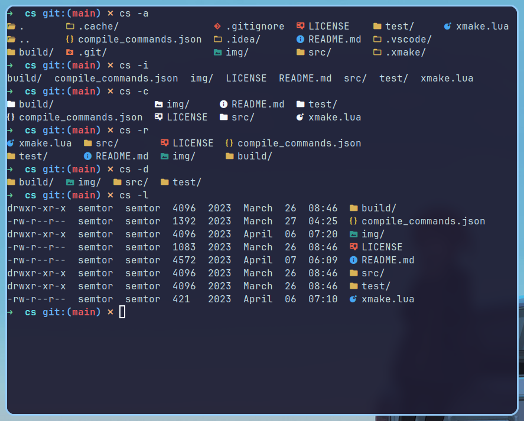
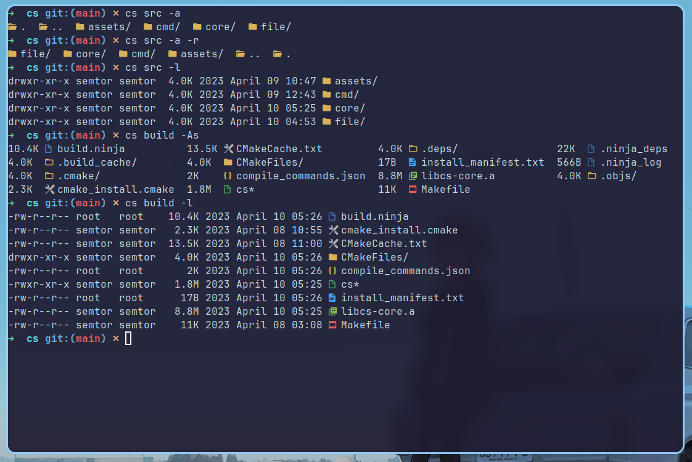
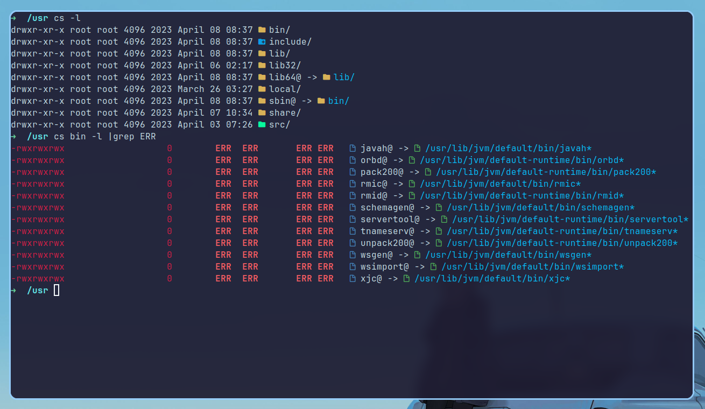

| [English](README.md) | [简体中文](README_zh.md) |

> A modern alternative to ls commands,more simple and beautiful.



- [Background](#Background)
- [Dependencies](#Dependencies)
- [Instructions](#Instructions)
- [Installation](#Installation)
- [Maintainers](#Maintainers)
- [Contribuite](#Contribute)
- [Contributors](#Contributors)
- [LICENSE](#LICENSE)

## Background 
>The 'ls' command on linux sometimes shows a not very intuitive effect, so 'cs' adds icons and different colors to it to improve the 'ls' experience.
>
> CS aims to have the same way of use as 'ls', and make the original functions richer, from
> the user's point of view, with a more friendly interface, through the differentiation of
> various icons and colors, we can find the information we need more quickly. After all, w
> ho doesn't want a beautiful and beautiful display?

## Dependencies
> - Font: Any kind of `nerd font`
> - Compiler: Compiler that supports c++17 
> - Build the project using `cmake`

For the installation of fonts, see [Dependent font installation](doc/font_install.md)

##  Instructions

> `info`:you can use option`-h` to show documention about how to use CS.

> The basic usage is the same as the `ls` command, in the directory you want to view, type the `cs` command to view the files in the current directory.



> How to use:

```
cs -[options] [directory]
Possible value for [options]:
  -a all       : show hidden files and directories
  -i icon      : close icons's shown
  -c color     : close colors's shown
  -h help      : show helping documention
  -A All       : show all files excepted '.' and '..'
  -r reverse   : reverse ranking
  -d directory : only show directories
  -l long      : show detailed information
```



> Of course, you can also specify the target directory to display, for example:
```sh
cs src
```
This allows you to display the content in the `src` directory.

> At the same time, you can also add any option while specifying the directory, all option locations are not fixed, and the destination directory location is also arbitrary, you can fill in at will.
>
> For example, `cs src -la` is legal, and `cs -l src -a` is also legal.



> `cs` can also show link file and point it's real path with specified color. If the link is broken(or the original file doesn't exist), `cs` will mark it using red color.



## Installation
> - if you are using archlinux or manjaro,or other arch based linux,you can install `aur` package `cs` with `yay` or other aur package manager.

```sh
yay -S cs
```

> - if you are using ubuntu or debian,or other debian based linux,you can download the deb package from [releases](https://github.com/semtor/cs/releases). And then install `cs` with `apt`:
```sh
sudo apt install ./<packagename>.deb
```

> for other linux, you can see [releases](https://github.com/semtor/cs/releases) or build the project manully:

```sh
git clone https://github.com/semtor/cs.git
cd cs
mkdir build&&cd build
cmake ..
make
sudo make install
```
## Contribute

We look forward to welcoming you! [Raise an Issue](https://github.com/semtor/cs/issues/new) or submit a Pull Request.

## Contributors

[@semtor](https://github.com/semtor)。

## LICENSE
[MIT](LICENSE) @ semtor
