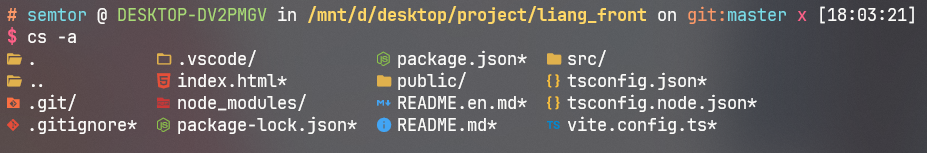
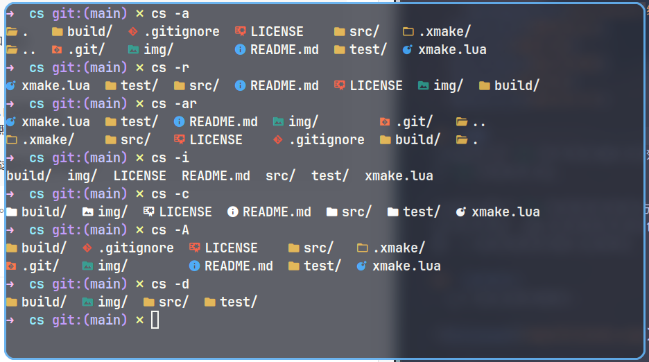

<div align=center>
  
</div>


> 一款现代化的ls命令的替代品,更加美观，功能更加强大

- [背景](#背景)
- [依赖](#依赖)
- [安装](#安装)
  - [字体安装](#字体安装)
    - [linux系统](#linux系统)
    - [windows系统](#windows系统)
  - [克隆本项目](#克隆本项目)
  - [进入到项目目录](#进入到项目目录)
  - [编译安装](#编译安装)
- [卸载](#卸载)
- [使用说明](#使用说明)
- [效果展示](#效果展示)
- [维护者](#维护者)
- [如何贡献](#如何贡献)
- [贡献者](#贡献者)
- [使用许可](#使用许可)

## 背景
>linux上的`ls`命令有时展示的效果不是很直观，于是`cs`给它加上图标和不同的颜色，提升`ls`的使用体验。
>
>cs旨在要与`ls`有相同的使用方式，并使原有的功能更加丰富，站在用户的角度，拥有更加友好的界面，通过各种图标和颜色的区分，我们可以更迅速的找到需要的信息。毕竟谁不想要一个美观漂亮的展示结果呢。

## 依赖
> - 字体: 任意一种nerd font
> - 编译器: 支持c++17的编译器


## 安装
### 字体安装
这个项目使用了[nerd font](https://www.nerdfonts.com/)，请确保终端使用的字体是任意一种[nerd font](https://www.nerdfonts.com/)。

如果没有安装nerd font，请前往[这里](https://www.nerdfonts.com/)下载并安装字体。

#### linux系统
> 如果您使用的是linux系统:
>
> 您可以使用以下命令查看已经安装的字体:

```sh
fc-list | less
```

> 如果有nerdfont，请将终端的字体设置为任意一种nerdfont。
>
> 如果没有，在上面提供的地址中下载好您喜欢的nerdfont之后，先将字体文件解压出来，这里以我下载的`Agave Nerd Font`为例,下载好后的文件是`Agave.zip`。

> 首先，我们要创建一个目录存储我们的字体,这里以创建一个AgaveNerd目录为例。

```sh
mkdir AgaveNerd
```
> 然后将刚刚下载好的字体文件移动到创建好的目录中。然后进入到目录中
```sh
mv Agave.zip AgaveNerd &&cd AgaveNerd
```
> 解压`zip`格式的压缩包需要使用`unzip`命令,如果您没有`unzip`命令，请先下载`unzip`命令。如果有的话请先跳过该段。


> 如果您的linux是基于Debian的系统，您可以使用下面的命令安装:
```sh
sudo apt install unzip
```
> 如果您的系统是基于Red Hat的，您可以使用以下命令安装:
```sh
sudo yum install unzip
```
> 如果您的系统是Arch系的，您可以使用下面命令安装:
```sh
sudo pacman -S unzip
```
> 对于其他linux发行版您可以去unzip的[官网](https://infozip.sourceforge.net/)自行下载安装。

> 然后可以使用`unzip`命令解压。

```sh
unzip Agave.zip
```
> 返回上一级目录，然后将上面创建的存放字体的目录移动到系统字体目录中。(这一步需要root权限)
```sh
cd ..
sudo mv AgaveNerd /usr/share/fonts
```
更新字体
```sh
fc-cache -vf
```
> 到这一步就已经成功安装`Agave Nerd Font`了。


#### Windows系统
> 如果您使用的是windows系统

> 下载nerd font后将其解压，以我下载的`Agave Nerd Font`为例，下载好后是一个`Agave.zip`文件，
先将文件解压。

> 解压后进入到文件夹中，鼠标左键全选，然后点击右键，选择`安装`即可安装字体。

> 然后将使用的终端的字体设置为任意一种`Nerd Font`即可。

### 克隆本项目
> 本项目目前使用编译安装，所以需要先克隆项目，同时确保您的c++编译器支持c++17标准。

```sh
git clone https://github.com/semtor/cs.git
```
### 进入到项目目录

```sh
cd cs
```

### 编译安装

> - 对于linux系统，可以直接`make`
```sh
sudo make install
```
> - 对于windows系统，目前使用mingw编译器已经可以成功编译使用，但使用msvc编译器仍会出现乱码。所以目前推荐使用mingw进行编译。

> 可以直接使用mingw-make，也可以使用cmake先构建项目在进行编译，值得注意的是，makefile是针对linux系统进行编写的，`make install`命令在windows上并不通用，所以install时推荐使用cmake，或者手动将生成的cs.exe添加到环境变量目录中。

##  卸载
> 对于linux系统,如果要删除`cs`，首先先进入到之前克隆的仓库目录。然后通过make命令删除编译后的二进制文件。
```
cd cs
sudo make uninstall
```
> windows系统用户需要自行找到安装的目录然后删除可执行文件`cs.exe`
##  使用说明

> `info`:可以通过`-h`参数查看详细的使用说明。


> 基础的使用方法和`ls`命令一致，在你想要查看的目录，键入`cs`命令即可查看当前目录中的文件。


> 如果想展示`隐藏`的目录，添加`-a`参数即可。




> 使用方法:

```
cs -[参数]
其中可供选择的参数如下:
  -a all   : 显示隐藏的文件和目录
  -i icon  : 关闭图标的显示
  -c color : 关闭颜色的显示
  -h help  : 显示帮助文档
  -l long  : 显示详细的信息(这部分还在开发中)

```
> 其他更多参数和功能也正在开发中。
##  效果展示
> 以下是全部的图标:


> 以下是运行时的部分截图:



## 维护者
[@semtor](https://github.com/semtor)。

## 如何贡献

非常期待您的加入！[提一个Issue](https://github.com/semtor/cs/issues/new)或者提交一个Pull Request。

## 贡献者


## 使用许可
[MIT](LICENSE) @ semtor
