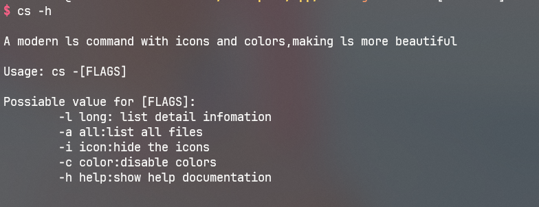

# *cs*

> 一款现代化的ls命令的替代品,更加美观，功能更加强大

# 效果

# 依赖
> - 字体: 任意一种nerd font
> - 编译器: 支持c++17的编译器

# 安装
> 1. 克隆本项目
`git clone https://github.com/semtor/cs.git`
> 2. 进入到项目录
`cd cs`
> 3. 编译源码
`sudo make install`
# 使用

- 使用命令`cs`即可列出当前目录的文件

## 可选参数

- `-a` ：列出所有文件，包括隐藏的文件和目录
- `-i` ：关闭图标的展示
- `-c` ：关闭颜色的展示
- `-h` ：列出帮助

