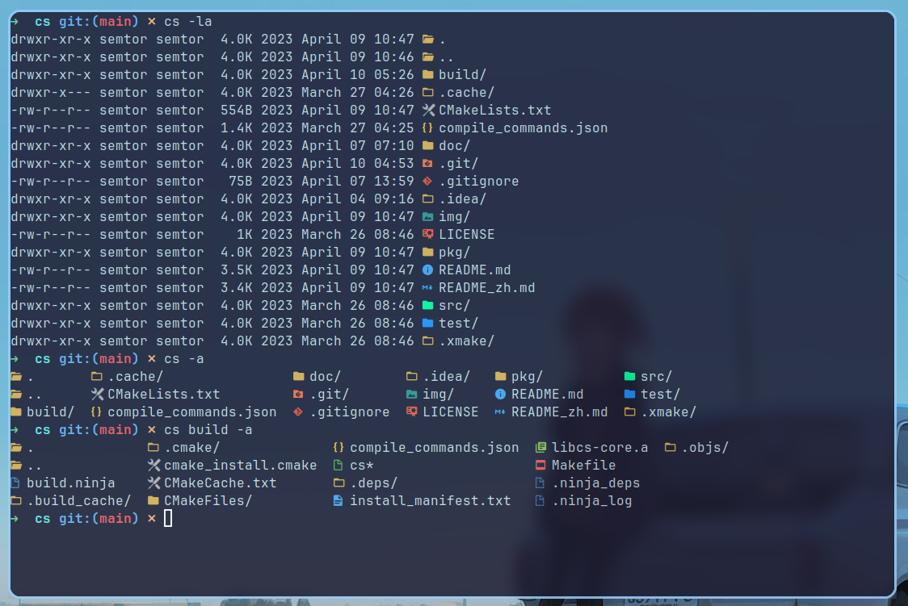

<!-- <div align=center> -->
<!--    -->
<!-- </div> -->


| [English](README.md) | [简体中文](README_zh.md) |
> 一款现代化的ls命令的替代品,简洁、美观。




- [背景](#背景)
- [依赖](#依赖)
- [使用说明](#使用说明)
- [安装](#安装)
- [维护者](#维护者)
- [如何贡献](#如何贡献)
- [贡献者](#贡献者)
- [使用许可](#使用许可)

## 背景
>linux上的`ls`命令有时展示的效果不是很直观，于是`cs`给它加上图标和不同的颜色，提升`ls`的使用体验。
>
>cs旨在要与`ls`有相同的使用方式，并使原有的功能更加丰富，站在用户的角度，拥有更加友好的界面，通过各种图标和颜色的区分，我们可以更迅速的找到需要的信息。毕竟谁不想要一个美观漂亮的展示结果呢。

## 依赖
> - 字体: 任意一种nerd font
> - 编译器: 支持c++17的编译器
> - 使用`xmake`构建项目


> - 字体的安装参见[依赖字体安装](doc/font_install_zh.md)


##  使用说明

> `info`:可以通过`-h`参数查看详细的使用说明。

> 基础的使用方法和`ls`命令一致，在你想要查看的目录，键入`cs`命令即可查看当前目录中的文件。


> 使用方法:

```
cs -[参数]
其中可供选择的参数如下:
  -a all       : 显示隐藏的文件和目录
  -i icon      : 关闭图标的显示
  -c color     : 关闭颜色的显示
  -h help      : 显示帮助文档
  -A All       : 显示除了. 和 ..的所有文件
  -r reverse   : 反向排序(默认按照文件名排序)
  -d directory : 仅显示目录
  -l long      : 显示详细的信息
```


> 当然，你也可以指定要显示的目标目录，例如:

```sh
cs src
```

这样就可以展示`src`目录下的内容。

> 同时，也可以在指定目录的同时添加任意选项，所有选项位置都是不固定的，目标目录位置也是任意的，可以随意填写。
>
> 例如`cs src -la`是合法的，`cs -l src -a`也是合法的。


## 安装
> - 如果你使用的是archlinux或者manjaro,或者其他arch系衍生的linux发行版，你可以直接通过`yay`或者其他包管理器从aur软件仓库安装cs.

```sh
yay -S cs
```
> - 如果你使用的是ubuntu或者其他debian及其衍生的linux发行版，先在[releases](https://github.com/semtor/cs/releases)下载对应的deb包，
然后通过`apt`安装`cs`:
```sh
sudo apt install ./<包名>.deb
```
> - 如果你使用的是其他Linux发行版，可以看[releases](https://github.com/semtor/cs/releases), 或者通过源码安装:

```sh
git clone https://github.com/semtor/cs.git
cd cs
mkdir build&&cd build
cmake ..
make
sudo make install
```

## 维护者
[@semtor](https://github.com/semtor)。

## 如何贡献

非常期待您的加入！[提一个Issue](https://github.com/semtor/cs/issues/new)或者提交一个Pull Request。

## 贡献者


## 使用许可
[MIT](LICENSE) @ semtor
